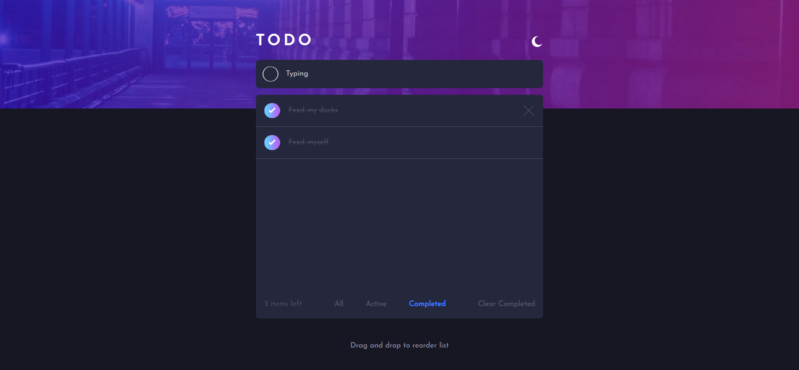
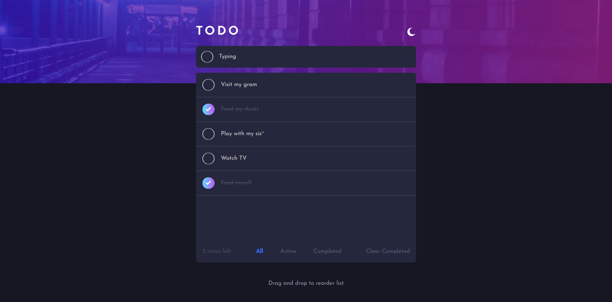
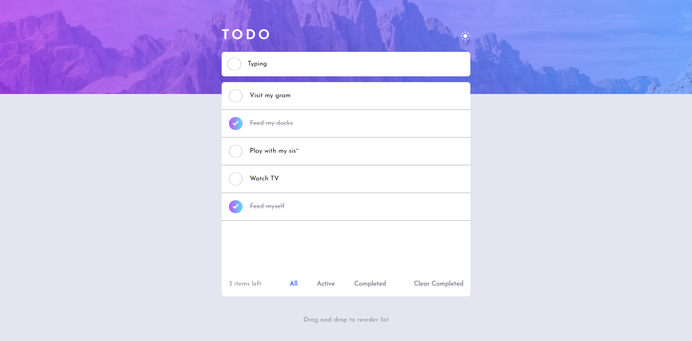
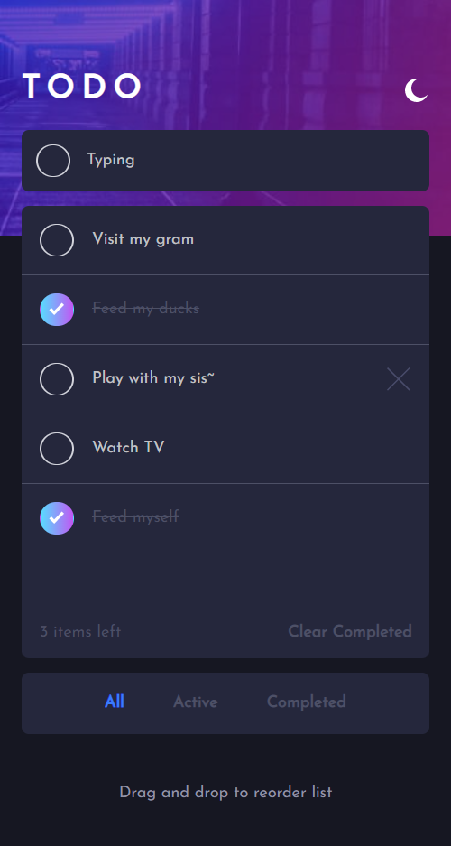
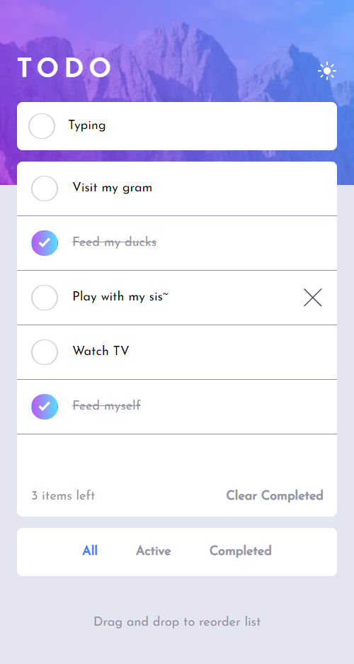

# Frontend Mentor - Todo app solution

This is a solution to the [Todo app challenge on Frontend Mentor](https://www.frontendmentor.io/challenges/todo-app-Su1_KokOW). Frontend Mentor challenges help you improve your coding skills by building realistic projects.

## Table of contents

- [Overview](#overview)
  - [The challenge](#the-challenge)
  - [Screenshot](#screenshot)
  - [Links](#links)
- [My process](#my-process)
  - [Built with](#built-with)
  - [What I learned](#what-i-learned)
  - [Continued development](#continued-development)
  - [Useful resources](#useful-resources)
- [Autho](#author)r

## Overview

### The challenge

Users should be able to:

- View the optimal layout for the app depending on their device's screen size
- See hover states for all interactive elements on the page
- Add new todos to the list
- Mark todos as complete
- Delete todos from the list
- Filter by all/active/complete todos
- Clear all completed todos
- Toggle light and dark mode
- **Bonus**: Drag and drop to reorder items on the list

### Screenshot

|  |  |
| ----------------------------------- | ------------------------------------ |

### Links

- Solution URL: [beautiful-to-do](https://github.com/Dalcio/beautiful-to-do)
- Live Site URL: [To DO App](beautiful-to-do.vercel.app)

## My process

### Built with

- Semantic HTML5 markup
- CSS custom properties
- Flexbox
- CSS Grid
- Mobile-first workflow
- [React](https://reactjs.org/) - JS library
- [Next.js](https://nextjs.org/) - React framework
- [Mantine UI](https://mantine.dev/) - A fully featured React component library
- [React Beautiful DND](https://github.com/atlassian/react-beautiful-dnd) - **Beautiful** and **accessible** drag and drop for lists with [`React`](https://facebook.github.io/react/)

### Useful resources

- [Using react-beautiful-dnd with Next.JS](https://www.codedaily.io/tutorials/Using-react-beautiful-dnd-with-NextJS) - NextJS server side renders, which if a library dependencies or requirements, this can mess up how a library operates.

## Author

- Website - [Dálcio Garcia](https://dalciogarcia.vercel.app)
- Linkedin - [dalcio-garcia](https://linkedin.com/in/dalcio-garcia)
- Github - [@dalcio](https://github.com/dalcio)
